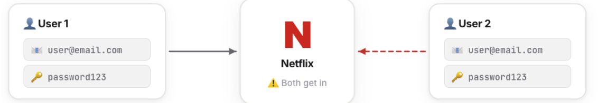
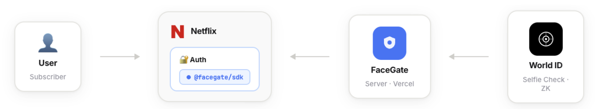

# FaceGate
**Credential sharing prevention SDK for subscription platforms — powered by World ID Selfie Check.**

> One account. One face. No sharing.

Streaming platforms lose $9.1 billion annually to credential sharing (Parks Associates, 2019). The password is correct — but the person isn't. FaceGate fixes this.

FaceGate is a developer SDK that adds face continuity verification to any subscription platform. Using World ID Selfie Check, it treats biometric identity as a **continuity and abuse-prevention signal** — confirming the same person returns on every login, not just the same password. 

This creates meaningful friction: even coordinated sharing requires the original account owner to be actively available for every single login, making casual credential sharing impractical. Zero biometric data stored.

---

## The Problem

One Netflix account. Five households using it. The platform loses revenue on every shared account. Password-based auth has no way to enforce "one person per account."

Current solutions — household IP detection, device limits — are easily bypassed with a VPN or device switch. They detect location, not identity.

FaceGate detects identity.



---

## How It Works

Plug FaceGate into your existing authentication flow — after signup and after every login. That's it.
 
1. **Signup** — user enrolls their face via World ID Selfie Check. A cryptographic nullifier is generated on-device and stored on our server. No face data, no images — just the nullifier.
2. **Every login** — user does a quick Selfie Check. FaceGate checks the nullifier matches the enrolled one → same face → access granted.
3. **Different face** — different nullifier → no match → blocked.
See [`demo-netflix/lib/facegate.ts`](./demo-netflix/lib/facegate.ts) for a complete integration in one file, and [`demo-netflix/`](./demo-netflix/) for a full working example.




---

## Repo Structure
 
```
facegate/
├── server/          — Next.js backend + developer dashboard → deployed to Vercel
│
├── sdk/             — @facegate/sdk npm package
│                      wraps World ID Selfie Check · nullifier-based · zero biometrics
│
└── demo-netflix/    — Netflix-style demo app (reference integration) → deployed to Vercel
```

---

## Architecture

FaceGate has three parts:

### 1. Server (server/)

The FaceGate server is a Next.js backend deployed on Vercel. It is the trust layer between platform developers and World ID.

**What it does:**
- Holds the FaceGate World ID credentials — the RP ID, signing key, and App ID. Platform developers never touch World ID directly.
- Issues API keys to developers via the dashboard. Each API key is paired with a unique action string for nullifier isolation.
- When a developer calls `gate.enroll()`, the server generates an RP signature using our World ID signing key and returns the `rpContext` needed to show the IDKit QR widget.
- When a developer calls `gate.verify()` or `gate.confirm()`, the server verifies the ZK proof with World's API (`/api/v4/verify/{rp_id}`), extracts the nullifier from the response, and stores or matches it in MongoDB.
- Stores only nullifiers in MongoDB — no face data, no images, no personal information.

https://face-gate-ecru.vercel.app/


### 2. SDK (sdk/)

Published as @facegate/sdk on npm. This is what platform developers install.

**What it does:**
- A thin HTTP client that wraps calls to the FaceGate server.
- Exposes four methods: `enroll`, `confirm`, `verify`, `check`.
- Handles API key auth on every request.
- Does not include the IDKit QR widget — due to a WebAssembly bundler constraint (webpack 5 cannot resolve wasm files from nested dependencies), developers must install `@worldcoin/idkit` directly alongside this SDK for the frontend widget.

https://www.npmjs.com/package/@facegate/sdk


### 3. Demo Netflix (demo-netflix/)

A Netflix-style demo app deployed on Vercel showing a complete FaceGate integration — signup with face enrollment, login with face verification, and access blocking for unrecognized faces.

https://demo-netflix-green.vercel.app/


---

## What World ID Does
 
World ID runs Selfie Check entirely on the user's device. When a user scans the IDKit QR code with the World App:
 
1. The World App performs **liveness detection** — confirming a real, live person, not a photo or video.
2. It generates a **zero-knowledge proof** on-device — cryptographic evidence that this face belongs to this World ID credential, without revealing any biometric data.
3. The proof is returned to the developer's frontend via the IDKit callback.
4. FaceGate's server verifies the proof with World's API and extracts the **nullifier** — a deterministic, anonymous identifier derived from the user's World ID, the app, and the action string.

World ID never sends face data off the device. FaceGate never receives face data. The only thing that moves is the ZK proof and the resulting nullifier.
 
---
 
## Nullifier Isolation
 
FaceGate is a **provider model** — one World ID account powers all downstream platforms. Each developer gets an API key paired with a unique action string. This means:
 
- The same user on Netflix produces nullifier A.
- The same user on Spotify produces nullifier B.
- A and B are completely different and unlinkable — the user's identity is isolated per platform.
- A user cannot be tracked across platforms even if both use FaceGate.

---

## Quick Start
 
### 1. Get your API key
 
Visit [face-gate-ecru.vercel.app](https://face-gate-ecru.vercel.app) → sign in with Google → generate your API key.
 
### 2. Install
 
```bash
npm install @facegate/sdk @worldcoin/idkit
```
 
> Note: `@worldcoin/idkit` must be installed directly in your app (not just as a transitive dependency) due to WebAssembly bundler resolution constraints. See FEEDBACK.md for details.
 
### 3. Add to your auth flow
 
**On signup — enroll face:**
```typescript
import { FaceGate } from '@facegate/sdk'
 
const gate = new FaceGate({ apiKey: 'fg_live_xxx' })
 
// After your existing signup logic
const { rpContext, appId, action } = await gate.enroll(userId)
 
// Use rpContext to show IDKit QR widget → user scans → Selfie Check runs
// After user completes scan, IDKit returns the proof:
await gate.confirm(userId, idkitProof)
// User is now enrolled — nullifier stored on FaceGate server
```
 
**On every login — verify face:**
```typescript
// After password check passes, get rpContext to show IDKit widget
const { rpContext, appId, action } = await gate.enroll(userId)
 
// User scans QR → IDKit returns proof
const result = await gate.verify(userId, idkitProof)
 
if (!result.authorized) {
  throw new Error('Access blocked — face not recognized')
}
// Same face confirmed → grant access
```
 
> Why is `gate.enroll()` called on login too? Because `enroll()` returns the `rpContext` needed to show the IDKit QR widget — it's the "get widget data" call. It works for both signup and login. On login, after the user scans, you call `gate.verify()` instead of `gate.confirm()`.

---

## SDK Reference
 
| Method | When to call | What it does |
|--------|-------------|--------------|
| `gate.enroll(userId)` | Signup + every login | Returns `rpContext`, `appId`, `action` needed to show the IDKit QR widget |
| `gate.confirm(userId, proof)` | After first face scan (signup only) | Verifies proof with World ID, stores nullifier — completes enrollment |
| `gate.verify(userId, proof)` | After returning face scan (login) | Verifies proof with World ID, checks nullifier matches enrolled one → returns `{ authorized: boolean }` |
| `gate.check(userId)` | Optional, before showing widget | Returns `{ enrolled: boolean }` — use to decide whether to show enroll or verify flow |

---

## Why Selfie Check
 
Selfie Check is a medium-assurance biometric credential — liveness detection without requiring Orb verification. It is the right tool for subscription abuse prevention because it works as a:
 
- **Continuity signal** — proves the same person returns on every login, not just the same password
- **Abuse-prevention signal** — eliminates passive credential sharing entirely
- **Friction by design** — coordinated sharing requires the account owner present in real time on every login, making it impractical at scale
- **Fairness signal** — ensures each paying account is used by its rightful owner
- **Liveness detection** — prevents photo and video spoofing
- **Zero biometric storage** — only cryptographic nullifiers stored, never face data
---
 
## Privacy
 
FaceGate stores nothing about the user's face. The Selfie Check runs entirely on the user's device. What gets stored:
 
- A **nullifier** — a cryptographic hash derived from the user's World ID credential, the app ID, and the action string. It proves continuity without revealing identity.
- Nothing else. No images, no biometric data, no personal information.
- Different apps produce different nullifiers — unlinkable across platforms.
---
 
## Links

- **Dashboard:** [face-gate-ecru.vercel.app](https://face-gate-ecru.vercel.app)
- **Demo:** [demo-netflix-green.vercel.app](https://demo-netflix-green.vercel.app)
- **npm:** [@facegate/sdk](https://npmjs.com/package/@facegate/sdk)
- **Presentation:** [Canva Slides](https://canva.link/it3ep8cg8xrx4h7)
- **Built at:** ETHGlobal Online 2026 — World ID Selfie Check prize track
